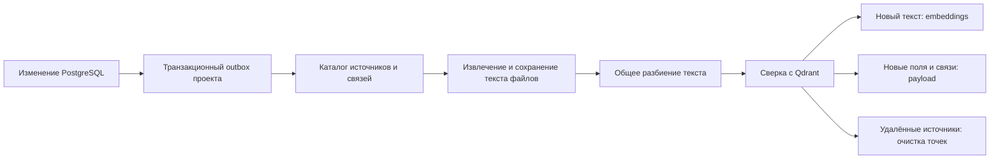

# Единые знания проекта

Реализация от 7 сентября 2026 года. Документ заменяет описание механизма индексации в прежнем отчёте об AI-вики; [первичный аудит](PROJECT_KNOWLEDGE_COVERAGE_AUDIT.md) сохранён как исходная постановка проблемы.

## Что гарантирует система

Проект — граница доступа и коллекции Qdrant. Любой содержательный объект имеет источник в общем каталоге, текущие поля, полный доступный текст и связи с другими источниками этого же проекта. Поиск не является единственным способом получить контекст: агент может перечислять источники, читать продолжение и проходить связи.

Полнота каталога не означает помещение всего проекта в один запрос LLM. Размер ответа ограничен, страницы и оставшийся непрочитанный контекст обозначены явно.

## Источники

Реестр находится в [`backend/src/knowledge/catalog.py`](../backend/src/knowledge/catalog.py). Он задаёт таблицу, путь принадлежности проекту, разрешённые поля, смысловой текст и тип источника.

| Тип | Содержание для embeddings и чтения |
|---|---|
| `project` | Паспорт и описание проекта; руководитель и период — в текущих полях и связях |
| `task` | Заголовок, описание и весь чек-лист, включая состояние пунктов |
| `document` | Весь Markdown документа |
| `comment` | Автор и весь комментарий |
| `attachment` | Название, метаданные и весь извлечённый текст файла |
| `milestone` | Веха и её описание |
| `risk` | Описание, план снижения и план реагирования; оценки, статус и контроль — в метаданных |
| `wbs_node` | Раздел ИСР и связи дерева |
| `stage` | Стадия канбана, порядок и признак завершения |
| `sticker` | Текст стикера, автор и связи с задачами |
| `member` | Публичное имя участника, логин, проектная роль и назначения |
| `activity` | Событие задачи, прежнее и новое значение |
| `deadline_change` | Прежний и новый срок проекта, автор и обязательный комментарий |
| `analytics_report` | Сохранённый отчёт конкретного проекта, помеченный как исторический вывод AI |

Чек-лист является частью задачи. Канбан представлен стадиями и задачами; свободная доска — стикерами и связанными задачами. Самостоятельных источников для голых строк связей не создаётся.

Пароли, токены и личные контакты исключены. Портфельные отчёты с `project_id = NULL` не попадают в проект. Визуальные координаты, оформление и технические поля перечислены в `EXCLUDED_FIELDS` с причиной. Тест покрытия требует явной политики для каждой таблицы и каждого столбца ORM: новую сущность или поле нельзя незаметно обойти.

## Связи и payload

У всех фрагментов одинаковый контракт: `schema_version`, `project_id`, `entity_type`, `entity_id`, `source_id`, `parent_source_id`, `related_source_ids`, `relations`, `task_ids`, `owner_task_id`, `properties`, `source_hash`, `text_hash`, `embedding_signature`, `chunk_index`, `chunks_count`, `text`.

`source_id` имеет вид `risk:12`; UUID точки определяется проектом, источником и номером фрагмента. `embedding_signature` учитывает модель и размерность вектора.

Граф содержит оба направления:

- проект ↔ руководитель и источники проекта;
- задача ↔ стадия, раздел ИСР, комментарий, вложение, событие;
- риск ↔ задача и ответственный участник;
- документ ↔ задача; стикер ↔ задача;
- задача ↔ участник с ролью;
- предшественник ↔ последователь с типом зависимости и лагом;
- веха ↔ раздел ИСР; родительский раздел ↔ дочерний;
- импортированный документ ↔ оригинальный файл.

`task_ids` означает связанные задачи. `owner_task_id` означает принадлежность комментария, вложения или события задаче. Поэтому удаление задачи не удаляет общий документ или риск. Оба конца связи разрешаются только по актуальному каталогу выбранного проекта.

## Один путь синхронизации

Триггеры PostgreSQL создают максимум одно задание для пары «проект + транзакция». Они работают для INSERT/UPDATE/DELETE, массовых SQL-операций и каскадов. Откат изменения откатывает и outbox. Изменение публичного профиля затрагивает все проекты его участия.

Задания разных зафиксированных транзакций не подменяют друг друга: изменение, пришедшее во время индексации, остаётся в очереди. Worker объединяет накопленные задания одного проекта в один проход; захват сериализует запись в его коллекцию. Приложение сохраняет текущую модель одного фонового worker с восстановлением прерванных заданий при старте.

Подготовка снимка и сохранение извлечённого текста выполняются в коротких DB-областях. Разбор файлов, vision, embeddings и обращения к Qdrant выполняются после их закрытия.

Обычное изменение и ручная переиндексация используют тот же алгоритм. Повторный проход без изменений не вызывает embeddings. Изменение текста, модели или размерности требует нового вектора; изменение только текущих полей или связей требует обновления payload. Лишние точки удаляются после успешной записи актуальных. Коллекция исчезает вместе с проектом; смена размерности пересоздаёт производную коллекцию после получения новых векторов.

## Файлы и FTS

Поддержаны PDF с текстовым слоем, DOCX, Markdown, TXT, CSV, LOG, Excel и изображения через настроенную vision-модель. Полный результат сохраняется в `knowledge_attachment_texts`; прежнего лимита 350 000 символов больше нет, в том числе при импорте документа. Разбор сохраняет ограничения форматов и размера загружаемого файла; OCR сканированных PDF не добавлялся.

Импорт сохраняет исходный текст файла в той же транзакции, что документ и связь. Повторное распознавание не требуется. Документ и оригинал остаются самостоятельными связанными источниками: последующее редактирование документа не скрывает исходный файл.

Недоступный, повреждённый, неподдерживаемый или пустой файл сохраняет метаданные и явный статус извлечения. Ошибка одного файла не мешает записи остальных источников; временные ошибки повторяются через очередь.

Общий FTS выполняется по тому же реестру разрешённых полей всех 14 типов. Извлечённые тексты ищутся в PostgreSQL даже при недоступном Qdrant или embeddings. Длинные тексты разбиваются на перекрывающиеся окна перед `to_tsvector`, чтобы лимиты PostgreSQL не исключали хвост файла. Поиск ограничивается проектом до построения векторов. Существующий быстрый поиск списков интерфейса сохраняет собственные GIN-индексы.

## Как агент получает контекст

Чат и MCP используют общий каталог и объединение FTS/семантических результатов через RRF. Qdrant возвращает до трёх подходящих фрагментов источника. Каждый кандидат проверяется по текущему PostgreSQL: удалённые и чужие источники исключаются, актуальные поля читаются заново, устаревший текст не передаётся модели.

Агент получает паспорт, точные количества источников, команду, релевантные фрагменты и ближайшие связи. SQL-инструменты по-прежнему отвечают за расчёт статистики и календарных последствий.

Для продолжения доступны `list_sources`, `read_source`, `related_sources`, `search_sources`. В MCP они объединены в `read_project_knowledge(project_key, request)`. У страниц есть `next_offset`; полное чтение длинного источника продолжается с указанного смещения. Чат допускает четыре раунда дочитывания, до восьми запросов за раунд, и затем формирует ответ с обозначением оставшихся пробелов. Ссылки принимаются только по выданным сервером хэндлам текущего запроса.

## Проверка готовности

Статус AI-вики сверяет ожидаемые источники и фрагменты с фактическими payload Qdrant. Для каждого типа видны `total`, `indexed`, `missing`, `stale`; отдельно показываются лишние точки и проблемы файлов. Само наличие коллекции больше не означает готовность.

Изменение схемы оформлено миграцией `f4a72c908e16`. Для нового окружения достаточно обычного `alembic upgrade head`: отдельного режима совместимости или переходного пайплайна нет.

Проверки покрывают реестр моделей и полей, все 14 типов в FTS, горизонтальные связи, транзакционность очереди, обновления во время обработки, большие файлы, актуальность поисковых результатов, страницы чтения, ошибки извлечения, повторную синхронизацию и работу с настоящими PostgreSQL/Qdrant.
